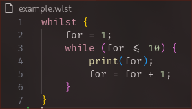

# **Whilst**
Have you ever felt like programming languages nowadays give you too many features? Well I certainly did.



## Description
Whilst is a functional, yet impractical programming language that relies on while loops ONLY. Devs' greed for convenience blinded them of the bloat they use of their day-to-day programming, for loops, if statements, match cases, and normal one-shot functions are all just propaganda designed to fool you, in reality all you need to program a functional app are while loops!

## Philosophy
- Turing complete: Any control flow can be expressed through while loops alone (Example: an `if` statement is just a `while` loop that exits on the first iteration).
- "Greed of convenience": Keywords like `if`, `else`, `for`, `def`, and `match`, are strictly forbidden and will trigger the compiler (technically a transpiler but who cares) to panic and quit, unless you use them as identifiers instead of control-flow keywords.
- Infinite superloop: In **Whilst**, execution never ends (non-terminating), the Whilst (superloop) keeps running forever and the dev has to structure their logic accordingly.

## Features
- **Whilst loops:** Infinite loops.
- **No bloat:** No `for` loops, no `if` statements, nothing.
- **Functional(ish):** Works.

## Syntax Overview
1. Conditionless Superloops
The root of every program lives inside a master `whilst` block that runs continuously.
```wlst
whilst {
    print("This loop will never die.");
}
```

2. Simulating `if` Statements
To run code once based on a condition, evaluate a boolean flag and reset it inside the loop body:
```wlst
is_five = (x == 5);
whilst (is_five) {
    print("x reached 5!");
    is_five = 0; // Guard condition mutated; acts as an 'if'
}
```

3. Looping Functions (`whilstf`)
Functions are defined using `whilstf`. The first argument is the loop condition, followed by function parameters:
```wlst
whilstf runOnce(active, msg) {
    print(msg);
    active = 0;
}

whilst {
    flag = 1;
    runOnce(flag, "Hello from Whilst!");
}
```
(runOnce is kind of a misleading name cause it will run again after the superloop finishes, it's only running ITS content once, if that makes sense)

4. No comment support yet, please don't use comments

## Quickstart & Usage
Transpile `.wlst` source files into executable Python using the CLI tool:
```sh
# Transpile source file to Python
python wlst.py -f count.wlst -o count.py

# Transpile and execute immediately
python wlst.py -f count.wlst && python count.py
```

## Counting 1-10 example:
```wlst
whilst {
    i = 1;
    whilst (i <= 10) {
        print(i);
        i = i + 1;
    }
}
```